# Yrityksen talous 7 tunnissa

## Miksi ?

Oletko koskaan toivonut, että kunpa kurssin X jokaisen luennon asia voitaisiin esittää yhtä laadukkaasti tiivistettynä kuin esimerkiksi 3Blue1Brown selittää [Bayesin teoreeman](https://youtu.be/HZGCoVF3YvM)?

Tai edes jotain sinne päin?

Monen kurssin luennot eivät ilmaise asiaa erityisen tiiviissä muodossa. Omasta mielestäni olisi siistiä, jos yliopisto voisi tiivistää luennot 20 minuutin youtube videoiksi. Moni voi ajatella toisinkin, mutta lopuille jotka haluavat oppia tehokkaasti tämä on pyrkimys, taloudellisin termein, nostaa opiskelijoiden tuottavuutta.

Mainittakoon, että tämä on vielä toistaiseksi työn alla ja 7 tuntia oli vain heitto, mikä kuulostaa hyvältä (5h luentoihin, 2h harkkoihin). Tiivistelmä ei myöskään ole täysin kattava, vaan keskittyy omasta mielestäni olennaisimpiin asioihin tentti mielessä pitäen.

Mikäli tästä on jotain hyötyä, kannustan muitakin joita kiinnostaa, jakamaan tiivistelmiään kursseista kanssaopiskelijoille. Mikäli tämän materiaalin kehittäminen kiinnostaa, ota yhteyttä teemu.helenius@tuni.fi tai tee pull request suoraan.

## Yleistä

Jokaisen luennon alussa on yleensä kertaus viime luennon asioista, sitä ei ole erikseen mainittu tiivistelmässä, mutta suosittelen kuitenkin katsomaan.

Kuvia on pyritty välttämään ja asiat on pyritty kirjamaan tekstimuodossa ylös. Kuvia on käytetty kun visuaalisesta hahmottamisesta on ollut hyötyä, tai liitetiedostojen muodossa.

## Sisällysluettelo

[Tentti](#tentti)

[Syntaksi](#syntaksi)

[Lyhenteet](#lyhenteet)

[Luento 1 Talousprosessi](#luento-1-talousprosessi)

[Luento 2 Taloustavoitteet, kirjanpidon lainsäädännöllinen perusta](#luento-2-taloustavoitteet-kirjanpidon-lainsäädännöllinen-perusta)

[Luento 3 Kirjanpitovelvollisuus, hyvä kirjanpito](#luento-3-kirjanpitovelvollisuus-hyvä-kirjanpito)

[Luento 4 Tilinpäätösperiaatteet](#Luento-4-Tilinpäätösperiaatteet)

[Luento 5 Pysyvien vastaavien ja vaihto-omaisuuden hankintamenojen jaksottaminen](#Luento-5-Pysyvien-vastaavien-ja-vaihto-omaisuuden-hankintamenojen-jaksottaminen)

[Luento 6 Siirtyvät erät, vastaiset menot ja menetykset, poistoero](#luento-6-siirtyvät-erät-vastaiset-menot-ja-menetykset-poistoero)

[Luento 7 Veroperusteiset varaukset, arvostaminen, osakeyhtiön pääoma](#Luento-7-Veroperusteiset-varaukset-arvostaminen-osakeyhtiön-pääoma)

[Luento 8 Osakeyhtiön oma pääöoma, varojen vähentyminen, osatuloutus, valmistus omaan käyttöön, mihin huomio tilinpäätöksessä](#Luento-8-Osakeyhtiön-oma-pääöoma-varojen-vähentyminen-osatuloutus-valmistus-omaan-käyttöön-mihin-huomio-tilinpäätöksessä)

[Luento 9 Kustannus, laskentatoimen ongelmat, katetuottoajattelu](#Luento-9-Kustannus-laskentatoimen-ongelmat-katetuottoajattelu)

[Luento 10 Katetuottojattelu, kustannuslaskennan perusasetelma, kustannuslajilaskenta (aine- ja työkustannukset](#Luento-10-Katetuottojattelu-kustannuslaskennan-perusasetelma-kustannuslajilaskenta-aine--ja-työkustannukset)

[Luento 11 Kustannuslajilaskenta, kustannuspaikkalaskenta, suoritekalkyylityypit, kalkyylit vs. liikekirjanpito
](#Luento-11-Kustannuslajilaskenta-kustannuspaikkalaskenta-suoritekalkyylityypit-kalkyylit-vs-liikekirjanpito)

[Luento 12 Tuotantotyypit ja laskentajärjestelmät, jakolaskenta sovelluksineen, budjetointi](#Luento-12-Tuotantotyypit-ja-laskentajärjestelmät-jakolaskenta-sovelluksineen-budjetointi)

[Luento 13 Standardikustannuslaskenta, investoinnit](#Luento-13-Standardikustannuslaskenta-investoinnit)

[Luento 14 Investointilaskentamenetelmät ja investointilaskelmien lähtöarvot](#Luento-14-Investointilaskentamenetelmät-ja-investointilaskelmien-lähtöarvot)

## Tentti

Tenttikysymyksien rakenne

Harkoissa 15/40 (38%)

Luennoilla = 25/40 (62%)

1 = Diskonttaus kaava = Tulo/((1+tuottovaatimus)^Vuodet)

Tulo = Rahasumma x vuoden päästä

Tuottovaatimus = esim. 10%=0.1

2 = Harkassa

3 = Talousprosessin kaaviokuva, väite esim. "Yrityksen ajatellaan toimivan kolme markkinan keskellä" tai "yrityksen toiminta jaetaan reaali ja rahaprosessiin", oikein vai väärin?

4 = [Yrityksen taloustavoitteet](#10530-yrityksen-taloustavoitteet)

5 = Mahdollisesti väite, esim. "Yleisesti käytetty tapa, mikä ei välttämättä ole ihan lainmukainen, on hyvä kirjanpitotapa" Oikein vai väärin? ➡️ Väärin. Lainmukaisuus on kaiken a ja o.
**Tai** tilinpäätösperiaatteista, joista puhutaan 4. [Luennolla](#Luento-4-Tilinpäätösperiaatteet).

6 = Luennolla 9 [Laskentatoimen perusongelmista](#5058-laskentatoimen-perusongelmat-laskelman-laatijan-tekemät-valinnat)

7 = Esim. Onko meno, tulo vai tuotto? Ei täyttä selvyyttä mitä kysymys voisi olla. 17% oikein kertoo, että pitää jotain ymmärtääkin.

8 = Harkassa

9 = Harkassa

10 = [Luento 10 asiaa](#Luento-10-Katetuottojattelu-kustannuslaskennan-perusasetelma-kustannuslajilaskenta-aine--ja-työkustannukset), ei tarkempaa kuvausta.

11 = Harkassa

12 = Harkassa, tiivistelmä poistoista:

- Poistoaika
- Poiston arvoperusta (Alkuperäinen-, jälleenhankintameno ja menojäännöspoisto)
- Poiston jaksottaminen
  - Tasan ➡️ Tasapoisto
  - Etupainotteinen ➡️ Menojäännöspoisto
  - Takapainoitteinen ➡️ Annuiteetttipoisto

13 = Katso luento 5 vaihto-omaisuuden [inventointimenettely](#10936-vaihto-omaisuuden-inventointimenettely). Luultavasti jonkinnäköinen väite tai laskuharjoitus. Laskuharjoitus tulee myöhemmin harkassa.

14 = Harkka + [Aineellisten hyödykkeiden jaksottaminen](#aineellisten-hyödykkeiden-jaksottaminen)

15 = [Jakolaskennasta](#1919-jakolaskenta)

16 = Harkassa

17 = Harkassa

18 = "Kustannuspaikkojen muodostamiseen tai ylipäätään kuvioihin liittyvä väite" Katso luento 11 [kustannuspaikkalaskentaan](#2502-kustannuspaikkalaskenta) liittyvät asiat

19 = Harkassa

20 = Lasku ja sanallisia väittämiä. Luennolta 13 [standardikustannuslaskennasta](#standardikustannuslaskenta).

21 = [Nettonykyarvon laskeminen](#620-nettonykyarvo)

22 = [Invenstointien laskentamenetelmät, laskelmien lähtöarvot](#2104-investointilaskelmien-lähtöarvot)

23 = [Budjettijärjestelmästä](#10517-budjettijärjestelmä) tai [Budjetointimenetelmistä](#10931-budjetointimenetelmät)

24 = Tuloslaskelmasta. Mikä (viidestä vaihtoehdosta) esitetään ennen liikevoittoa?

25 = Tuloslaskelmasta. Mikä (viidestä vaihtoehdosta) esitetään liikevoiton jälkeen?

26 = Tuloslaskelmasta. Ei tarkempaa tietoa, "pääotsikko tasolla"

27 = Liikevoitto = Liikevaihto - mukut - kikut - poistot.

28 = Taseesta. Ei tarkempaa tietoa, "pääotsikko tasolla"

29 = Taseesta. Ei tarkempaa tietoa, "pääotsikko tasolla"

30 = Taseesta. Ei tarkempaa tietoa, "pääotsikko tasolla"

31 = Ei tarkempaa tietoa, monta eri vaihtoehtoa, katso tenttikysymysten moniste.

32 = Harkassa

33 = [Laajempaa ymmärrystä tilinpäätöksestä](#11215-mihin-kiinnittää-huomiota-tilinpäätöksessä)

34 - 40 Harkoissa

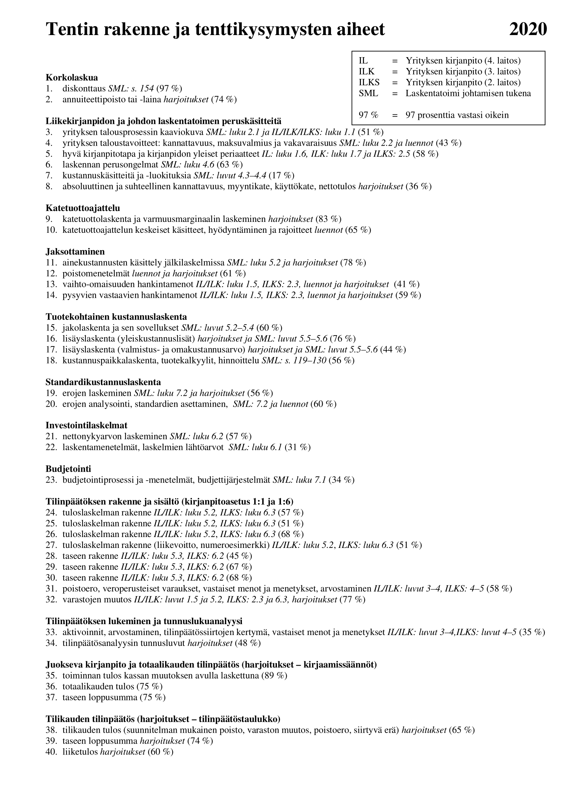

## Syntaksi

@Aika = luentotallenteen aika

(Kuvittele kun luennot löytyisivät YouTubesta, niin aikaleimat olisi vielä kätevämpiä.)

^ = Potenssi

## Lyhenteet

EVL = Elinkeinoverolaki

ORK = Oikeusrekisterikeskus

KILA = Kirjanpitolautakunta

KPL = Kirjanpitolaki

KOM = Käyttöomaisuus

VOM = Vaihto-omaisuus

ROM = Rahoitusomaisuus

OPO = Oma pääoma

VPO = Vieras pääoma

LVPO = Lyhyt vieras pääoma

SVOP-rahasto = Sijoitetun vapaan oman pääoman rahasto

FIFO = First in first out

LIFO = Last in first out

MUKUT = Muuttuvat kustannukset

KIKUT = Kiinteät kustannukset

YK-lisät = Yleiskustannuslisät

Oma mp= Oma mielipide

aka = also known as

### Luento 1 Talousprosessi

Ekat 42 min yleistä kurssista.

@42:00 Kurssin aiheet

@44:45 Tenttikysymys 3.

@48:10 Talousprosessin kaaviokuva

- Tuotannontekijä markkinat (hankintaan resursseja)
- Yritys (prosessoidaan resursseja, joilla tarkoitus tehdä voittoa)
- Suoritemarkkinat (Ostajat, myydään yrityksen aikaansaannos)
- Rahoitusmarkkinat (Ostetaan aikaa, yleensä resurssit maksetaan ennen tuloja)

Huomioitavaa:

- Raha ja reaaliprosessi jaettu erikseen. ➡️ Raha ja tavara voivat liikkua eri aikaan.
- Pääoman palautus sisältää myös korvauksen, kukaan ei halua lainata rahaa ilmaiseksi. (Korko)

@1:04:20 Pääoman kiertokulkumalli. Miten pääoma kulkee markkinoilla.

#### @1:05:30 Yrityksen taloustavoitteet

- Kannattavuus = Tulot > Menot
  - Työkaluja: Tuotekohtainen kustannuslaskenta, budjetointi.
  - Mittareita
    - Absoluuttiset: Myyntikate, käyttökate, liiketulos
    - Suhteellisia: ROI aka sijoitetun pääoman tuottoaste, tulee harkassa.

  - @1:14:10 Tenttikysymys 27.

- @1:17:37 Maksuvalmius = Yrityksellä pitää olla käteistä tarpeeksi **joka hetki**
  - Kannattavakin yritys voi ajautua konkurssiin liian pienellä kassalla. Liittyy myös yrityksen luotettavuuteen muiden silmissä.
  - Nopeasti kasvava yritys. (Vrt. Startupit ja [Cash is king](https://en.wikipedia.org/wiki/Cash_is_king))
  - Työkaluja: Rahoitusbudjetti
  - Mittareita
    - Quick Ratio
      - kaava: ROM/LVPO
      - viitearvo: tyydyttävä 0,5-1 (Hyvä suurempi)
    - Current Ratio
      - kaava: (ROM+VOM)/LVPO
      - viitearvo: tyydyttävä 1-2 (Hyvä suurempi)

- Vakavaraisuus käsitellään seuraavan luennon alussa

### Luento 2 Taloustavoitteet, kirjanpidon lainsäädännöllinen perusta

@9:00 Makrotalouden toiminnasta, [How The Economic Machine Works by Ray Dalio](https://youtu.be/PHe0bXAIuk0)

@11:45 Jatkoa yrityksen taloustavoitteista

- Vakavaraisuus = Pääoman rakenne. Onko yritys räjähtävä aikapommi(suuret velat) vai järkevä (sopiva määrä velkaa)? Tämä määritellään OPO:n suhteena VPO:hon.
  - OPO
    - Tarkoitettu pysymään yrityksessä, omistusoikeus yritykseen
    - Korvaus OY(j):ssä = osinko, omistajille voittoa
    - Ei vakuuksia. Jos yritys menee konkaan ei kukaan takaa menetyksiä.
    - "Varoja ei saa jakaa, jos jaosta päätettäessä tiedetään tai pitäisi tietää yhtiön olevan maksukyvytön tai jaon aiheuttavan maksukyvyttömyyden." [Finlex, ctrl+f "Maksukyky"](https://www.finlex.fi/fi/laki/ajantasa/2006/20060624#a624-2006)

  - VPO
    - Maksetaan pois (lyhennykset), ei omistusoikeutta yritykseen
    - Korvaus = korko, velan antajille voittoa
    - Vakuudet. Harva antaa velkaa ilman takeita (aka vakuuksia) takaisinmaksusta.
    - Pitää maksaa pois, prioriteetti yrityksen varoihin jos yritys maksukyvytön, maksetaan vakuuksien muodossa.

  - @16:45 Timo Sallin näkemys mitä vastavalmistuneelta DI:ltä halutaan. 2 Asiaa: Kykenee ja haluaa myydä suomalaisia tuotteita kansainvälisessä ympäristössä sekä pärjää juridisoituvassa maailmassa eli osaa ottaa huomioon juridisuuden päätöksenteossa.

  - @19:53 Osakeyhtiön varojenjakotavat ja pääoman pysyvyys. Pääomaa ei saa jakaa kuin laissa säädetyillä tavoilla. Yleinen laillinen tapa on voitonjako osinkoina.

@32:30 Kausivaihtelu = Sesonki

- Aikajänne vuosi
- Ei liity vakavaraisuuteen (Säännöllistä)
- Normaali ongelma, sesonkin tulee ja menee joka vuosi.
- Ratkaisuja
  - Sesonki työntekijät
  - Varastointi
  - Alihankinta

@40:20 Suhdannevaihtelu

- Toimialakohtaista (Vrt. Koronan vaikutus ravintoloihin vs. ohjelmistoyrityksiin)
- Aikajänne 4-7 vuotta
- Liittyy vakavaraisuuteen (Epäsäännöllisen säännöllistä)
- Ongelma, jota vaikea ennakoida.

@56:35 Vaihtelu pitkällä aikavälillä

- Aikajänne 40-70 vuotta

@1:08:35 Kondratjevin aallot

- Suhteessa teknologisiin revoluutioihin esim. Rautatiet, autot, tietokoneet

@1:15:20 Tulevaisuuden työt ja ihmisten rooli. [Humans Need Not Apply](https://youtu.be/7Pq-S557XQU)

@1:25:45 Liikekirjanpidon sääntely

- Juokseva kirjanpito, KPL säätelemä
  - Sääntely kansallista
- Tilinpäätös, tilinpäätösdirektiivin säätelemä
  - Sääntely kansainvälistä

### Luento 3 Kirjanpitovelvollisuus, hyvä kirjanpito

@8:58 Tämän viikon asioiden esittely

#### @15:45 Kirjanpitovelvollisuus

Kirjanpitovelvollisia

- Yritys
- Liike- ja ammattitoiminnan harjoittaminen (kuka tahansa)

@17:44 Mikä on liike- tai ammattitoimintaa? Nyrkkisääntönä toimii, liiketoimintaa on toiminta, josta voi hahmottaa talousprosessin muodostuvan. Myös riskin ja mahdollisen taloudellisen vahingon kasvaessa tulkitaan herkemmin liike- tai ammattitoiminnaksi.

@36:10 Kirjanpitovelvollisuus tulkitaan ennakkotapauksien perusteella, ei tarkkaa rajaa. Maalaisjärjen käyttö sallittua.

@41:40 Pienimuotoisen kirjanpitovelvollisen helpoitukset

- Ei velvollisuutta kahdenkertaiseen kirjanpitoon, mikäli kaksi kolmesta täyttyy
  - Taseen loppusumma alle 100 000€
  - Liikevaihto alle 200 000€
  - Palveluksessa keskimäärin alle 4 henkilöä

- @44:10 Kaksi seuraavista kolmesta ehdoista täyttäneenä, ei tarvitse laatia tilinpäätöstä. Ns. Mikroyritys
  - Taseen loppusumma alle 350 000€
  - Liikevaihto alle 700 000€
  - Tilikauden aikana palveluksessa keskimäärin enintään 10 henkilöä

@41:10 Muistiinpanot kirjanpitovelvollisuudesta

@51:36 Tilikauteen liittyvä tarkennus. Helpoitetun kirjanpidon tilikausi on aina kalenterivuosi. Mikäli tästä poiketaan, pitää tehdä kahdenkertainen kirjanpito.

@53:40 Forms tenttiin tuleville voi olla lainsäädännössä kiperämpiä kysymyksiä/väittämiä. Esim. Aiemmin mainittu asia.

@55:37 Hyvä kirjanpitotapa

@59:15 Hyvän kirjanpitotavan lähteet

- Lainsäädäntö
- Kirjanpitolautakunta (KILA)
  - Yleisohjeet
  - Lausunnot
- Alan **järjestöjen** kannanotot. Ei yksityishenkilöt!

@1:01:25 Tenttikysymys 5.

@1:23:00 Tilinpäätöksen oikea ja riittävä kuva

- Tulos eli kannattavuus
- Taloudellinen asema eli maksukyky ja vakavaraisuus
- Näkökulmana on, että ammattilainen pystyy ymmärtämään yrityksen tilanteen tilinpäätöksen perusteella. Maallikon ei tarvitse ymmärtää.

### Luento 4 Tilinpäätösperiaatteet

@8:00 Tilinpäätöksen olennaisuus. Epäolennaiset seikat saavat poiketa KPL.

- Näitä voivat olla esimerkiksi jaksottamiseen tai arvoittamiseen liittyvät asiat
- Ei koske liiketapahtumia. Kaikki liiketapahtumat tulee kirjata!

@13:12 Johdonmukaisuuden periaate. Valittua tapaa tulee noudattaa jatkossakin.

@20:03 Yleiset tilinpäätösperiaatteet

- Oletus, että toiminta on jatkuvaa
- Johdonmukaisuus eli samaa tapaa käytetään tilikaudesta toiseen. Ei vaihdeta tapoja tilikausien välillä. Mikäli tarve vaihdolle, tehdään se selväksi tilinpäätöksessä ja pitäydytään siinä. Vähän kinkkinen asia.
- Sisältöpainotteisuus eli ei yritetä kusettaa vaikka juridisesti mahdollisuus kikkailla. Tulkinnanvarainen, maalaisjärki sallittua.
- @36:15 **Varovaisuus** esitetään yrityksen tulos mielummin liian pienenä kuin liian suurena.
- Tasejatkuvuus. Tilinavaus perustuu edelliseen taseeseen.
- Suoriteperuste. Tilinpäätös tehdään suoriteperusteisesti.
- Erillisarvoistus. Merkittävät erät tulee arvostaa jokainen hyödyke kerrallaan. Poikkeuksena hyödykkeet, jotka pysvyvät vuodosta toiseen samana.
- Netottamiskielto. Tulot ja kulut erikseen, ei see netottaa (summata yhteen).

Oma mp: Mitenköhän varovaisuus toteutuu jenkkilässä ja yrityskaupoissa :D

@50:00 Muita yleisiä periaatteita

- Erillisyys eli erotetaan rahat yksityisistä varoista
- Vakaa rahanarvo
- Vertailtavuus

@57:20 Kirjanpidon yhteys talousprossiin, valmis kuva alla. Punainen ympyrä tarkoittaa tilinpäättäjän vaikutusaluetta, mikä taas vaikuttaa yrityksen tulokseen ja taseeseen.

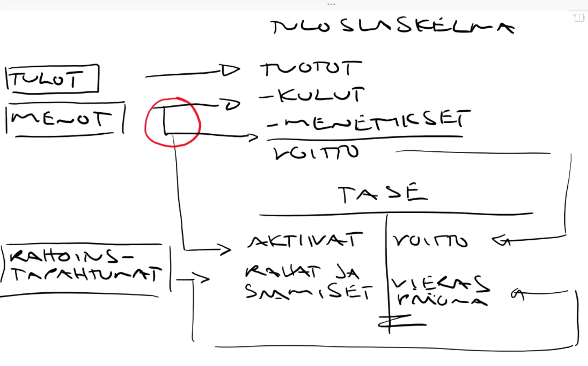

@1:02:00 Tenttikysymys 7.

@1:12:47 Tuloslaskelma ja tase tarkemmin. [Moodle linkki](https://moodle.tuni.fi/pluginfile.php/736555/mod_page/content/27/Tuloslaskelma_ja_tase-2020.pdf)

@1:14:30 Tase pääotsikko tasolla, valmis kuva alla. Huomaa [likvidisyyden](https://fi.wikipedia.org/wiki/Likviditeetti) lisääntyminen ylhäältä alaspäin!

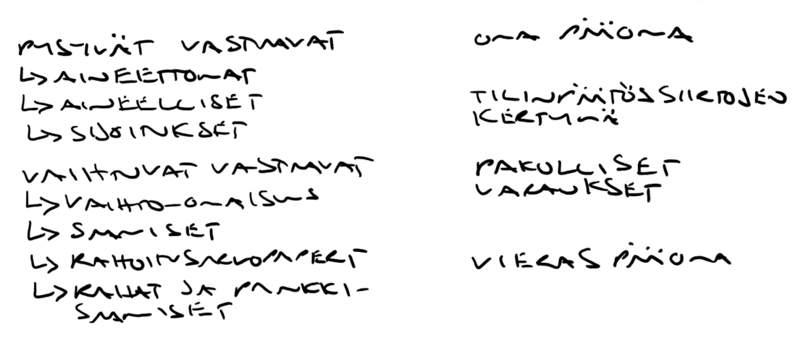

@1:25:20 Tenttikysymykset 24. 25. 26. 28. 29. ja 30.

### Luento 5 Pysyvien vastaavien ja vaihto-omaisuuden hankintamenojen jaksottaminen

@3:13 Tämän viikon tenttikysymyksiä (Jaksottaminen: 11-14 ja 31. 32.)

#### Aineettomien hyödykkeiden jaksottaminen

@6:21 Aineettomien oikeuksien jaksottaminen

- Vastikkeellisesti hankitut pitää aktivoida eli jaksottaa. esim. patentti
- Jos itse luotu, saadaan aktivoida.

- Oma mp: En ihan täysin ymmärtänyt, saa tarkentaa.

@8:35 Perustamismenot kirjataan kuluksi

@9:18 Tutkimus- ja kehittämismenot

- Tutkimusmenot kuluksi
- Kehittämismenot saadaan aktivoida, mikäli niiden odotetaan tuottavan tuloa useampana tilikautena.
- Tutkiminen on tutkimista ja kehittäminen on tutkimuksen tai tietämyksen soveltamista ennen tuotannon tai käytön aloittamista. Esim koelaitoksen suunnittelu.
- Kehittämistä EI ole koulutuksen tai organisaation kehittäminen, laaduntarkkailu, tuotannon ongelmien ratkaisu, olemassa olevan tuotteen kehittäminen tai tuotannon mukauttaminen esim. kausivaihteluun.

@23:18 Liikearvon hankintamenon jaksottaminen

- "Liikearvo sisältää vaikeasti arvotettavaa aineetonta arvoa, jota yrityksellä arvioidaan ostohetkellä olevan. Se sisältää brändien, työntekijöiden osaamisen, patenttien, asiakassuhteiden tai hyvän maineen odotuksia, joilla arvioidaan olevan sellaista arvoa, josta kannattaa maksaa kirja-arvoa korkeampi hinta. Liikearvon määrä syntyy vasta kauppahinnan sopimisen yhteydessä." [Wikipedia](https://fi.wikipedia.org/wiki/Liikearvo)
- "Mikäli yrityskauppa tehdään summalla, joka ylittää ostettavan yrityksen kirjanpitoarvon, tämä summa merkitään ostavan yrityksen taseeseen liikearvona" [Wikipedia](https://fi.wikipedia.org/wiki/Liikearvo)
- Saadaan aktivoida
- Oma mp: En osannut tiivistää paremmin kuin wikipedia asian ilmaisi, saa tiivistää.

@27:46 Aineettomat hyödykkeet tiivistelmä

- Pääsääntö: Aktivointi mahdollisuus tai saadaan kirjata kuluksi
- Vastikkeellisesti hankitut oikeudet pitää aktivoida
- Perustamis- ja tutkimusmenot aina kuluksi
- Kehittämismenot saa aktivoida

#### Aineellisten hyödykkeiden jaksottaminen

@35:59 Aineellisen omaisuuden hankintamenon jaksottaminen.

- Poisto (eli kyseiselle tilikaudelle kuuluva osuus hankinnan hinnasta) kuluksi
- Loput aktivoidaan aktiivaksi
- Eri poistomenetelmät tulee myöhemmin harkassa

@54:45 Poistosuunnitelman muuttaminen. Poistosuunnitelma tulee arvioida jokaista tilinpäätöstä luodessa. Eli varmistaa, että se vastaa vielä todellista pitoaikaa. Esim. Jos kone näyttää huonoja merkkejä ennen aikojaan, pitää poistosuunnitelma käyttännössä lyhentää, koska kone menettää arvonsa alkuperäistä arvioita nopeammin. Mahdollista myös pidentää päinvastaisessa tilanteessa.

@57:49 Pienen kirjanpitovelvollisen helpotukset poistamisen suhteen.

- Saa poistaa verotuksen myöntämän poiston. Eli verotus ja poistot näin ollen menevät samaa tahtia.
- Vähäarvoiset hankinnat (Käytössä alle 3 vuotta TAI arvoltaan alle 850€) saa kirjata tilikauden kuluksi, ei tarvitse tehdä poistosuunnitelmaa.

#### @1:03:52 Vaihto-omaisuuden jaksottaminen

@1:05:15 Vaihto-omaisuuden hankintamenon jaksottaminen

- Tilikauden päättyessä jäljellä olevan vaihto-omaisuuden hankintameno aktivoidaan.
- Jos nykyinen myyntihinta (luovutushinta) tai nykyinen ostohinta (jälleenhankintameno) on pienempi kuin alkuperäinen ostohinta **tilikauden päättyessä**, kirjataan erotus kuluksi. Esim. ostit kirveen 50€. Nykyinen hinta on 40€. Kuluksi kirjataan siis 10€ ja 40€ aktivoidaan.

#### @1:09:36 Vaihto-omaisuuden inventointimenettely

- Määrä x hinta, missä hinta on alin [aiemmista](#10352-vaihto-omaisuuden-jaksottaminen) vaihtoehdoista varovaisuusperiaatetta noudattaen.
- Oletus käyttöjärjestys = FIFO
- Muita: LIFO, Keskihinnan menetelmä (Näistä tarkemmin myöhemmässä harkassa)

@1:15:04 Hankintamenon määrittely = Hankinnasta ja valmistuksesta aiheutuneet välittömät menot

- Halutessaan saadaan kohtuullinen määrä myös välillisiä menoja
- Välillisiä menoja ovat esim, valmistuksen varastot, tuotannon johdon palkat ja pysyvien vastaavien poistot. Eli menot, jotka ovat läheisesti tekemisessä VOM:in kanssa.

### Luento 6 Siirtyvät erät, vastaiset menot ja menetykset, poistoero

@0:15 [Superopiskelija](http://www.tommivalkonen.com/superopiskelija-3/)

@18:21 Tenttikysymykset 11. ja 13.

@25:02 Tenttikysymys 32.

@25:50 Tavallinen pilaantuminen/arvonalentuminen huomiodaan inventointimenettelyä käyttäen, ei poikkeuksellisissa arvonalentumisissa! Poikkeuksellinen arvonalentuminen voisi olla esimerkiksi varaston palaminen.

@32:20 Siirtovelat ja -saamiset = Vuokrien, korkojen ja vakuutusmaksujen ajoittamiseen liittyvää säätämistä (Siirretään kohdistamisperusteen mukaisesti "oikealle" tilikaudelle)

- Siirtosaaminen = Meno, mikä on joko maksettu etukäteen (EI ennakkomaksu) tai tulo, mikä saadaan edelliseltä tilikaudelta (EI kuitenkaan laskutus/myyntisaaminen).
- Siirtovelka = Meno, joka toteutuu vasta tulevana tilikautena tai meno, mikä kuuluu edelliselle tilikaudelle. (Ei ennakkomaksu tai ostovelka)
- Ei siis ole tavaraa mitä myydään ja ostetaan, vaan määräytyvät usein **ajankulumisen perusteella**. Esimerkiksi vuokrat, korot ja vakuutusmaksut.

@53:25 Tenttikysymykset 31. 33. ja 38.

38 = Tulee harjoituksessa

@56:18 Vastaiset menot ja menetykset sekä pakollinen varaus

- Pitää olla tapahtunut joko aiemmalla tai nykyisellä tilikaudella
- Toteutuminen pitää olla todennäköistä
- Perustuu lakiin tai sopimukseen
- Kaikki yllä tulee toteutua!
  - ➡️ Mikäli määrä ja aika tiedossa, esitetään siirtovelkana.
  - ➡️ Muuten pakollinen varaus, **arvioitu** meno kuluksi tuloslaskelmaan ja vastakirjaus pakollisiin varauksiin
  - Huom. Arvioinnilla voi yrittää pelata, epäselvää mikä on laittoman huono arviointi

@1:16:30 Tenttikysymykset 31. ja 33.

@1:18:10 Poistoero = verosuunnittelua

- Mahdollisuus kirjata suunnitelman ylittäviä poistoja veroperusteisista syistä

@1:24:25 Esimerkki poistoerosta ja sen hyödyntämisestä

### Luento 7 Veroperusteiset varaukset, arvostaminen, osakeyhtiön pääoma

@4:35 Veroperusteinen varaus

- Saadaan tehdä investointi-, toiminta- tai muu veroperusteinen varaus
- Mahdolliset varaukset löytyvät EVL:stä
- Ei tarkoitus opetella tarkasti
- Lisäys ➡️ tulos ⬇️
- Vähennys ➡️ tulos  ⬆️
- Muutokset tuloslaskelmaan, kertymät taseeseen (niinkuin yleensäkin)

@31:40 Tenttikysymykset arvostamisesta 31. 33.

#### Arvostaminen

@32:57 Arvostaminen

- Taseeseen merkitään
  - Saamiset todennäköiseen arvoon
  - ROM markkinahintaan
  - VOM inventointimenettelyllä

- Tuloslaskelmaan
  - Arvonalennukset kuluksi

@40:12 Yhteenveto arvostamisesta

@49:53 Arvonkorotus voidaan tehdä pysyvien vastaavien maa- tai vesialueeseen tai arvopaperiin.

- Ei saa olla [johdannaissopimus](https://fi.wikipedia.org/wiki/Johdannainen) tai rakennus
- Näkyy vain taseessa, ei vaikuta tulokseen.
- Voi vaikuttaa tunnuslukuihin
- Varovaisuusperiaatetta noudattaen pitää olla merkittävä ja tarpeeksi pysyvä arvonkorontuminen

@1:04:25 Poistoajan merkitys yrityksen kannattavuuteen/tulokseen. Maa- ja vesialuella sekä sijoituksilla ei ole poistoaikaa! Alla moodlesta löytyvä taulukko poistoajoista.

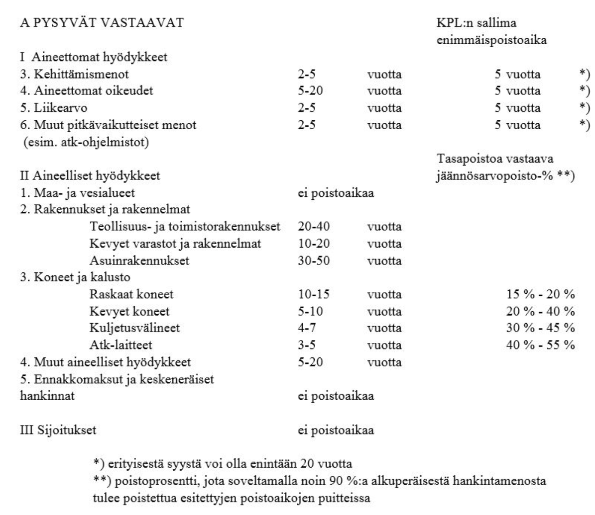

@1:17:40 Osakepääoma, sen pysyvyys, varojen jakaminen (kertaus) ja arvonalentaminen

@1:24:13 Velkojensuojamenettely (osakepääoman alentaminen)

- Pitää ilmoittaa julkisesti oikeusrekisterikeskuksen (ork) kuulutusrekisterissä.

### Luento 8 Osakeyhtiön oma pääöoma, varojen vähentyminen, osatuloutus, valmistus omaan käyttöön, mihin huomio tilinpäätöksessä

@3:36 Osakepääoma tiivistelmä

@11:09 Käyvän arvon rahasto = Johdannaissopimuksia ja muita rahoitusvälineitä.

- Arvon muutokset yleensä tuloslaskelmaan, joskus käyvän arvon rahastoon.

@23:55 SVOP-rahasto tiivistelmä = paikka rahoille, mitkä saa helpommin ulos yrityksestä.

- Se osa merkintähinnasta, jota ei merkitä osakepääomaan
- Ei ole sidottua pääomaa

@36:20 Kaikki osakepääoma on sidottua paitsi SVOP-rahasto ja yrityksen voitto. (Muut rahastot sopimuksen mukaan)

@39:05 Osakepääoman vähentyminen negatiiviseksi

- Hallituksen tehtävä viipymättä osakepääoman menettämisestä rekisteri-ilmoitus!
- Varoja ei saa jakaa maksukykyä vaarantaen eikä muuten kuin laissa määritellyillä tavoilla!

@54:33 Osatulotus eli tulon kirjaaminen tuotoksi valmiusasteen perusteella. Vaatimukset, kaikki pitää toteutua.

- Pitkä valmistusaika, ei tarkkaa rajaa yleensä reilu vuosi.
- Sitova tilaus
- Arvo olennainen liikevaihtoon verrattuna
- Erilliskatteiden ennakoitavuus (Menot synkassa tulojen kanssa)
- Noudattaa hyviä yleisiä periaatteita (esim. varovaisuus)

@1:04:25 Valmistus omaan käyttöön. Tulee ilmetä kirjanpidosta.

#### @1:12:15 Mihin kiinnittää huomiota tilinpäätöksessä

- Kannattaa aloittaa taseesta
- Nyrkkisääntönä mitä enemmän asioita tungettu taseeseen, sen enemmän pitää huolestua ja ottaa selvää miksi niin on tehty.
- Miltä näyttää yrityksen voitto, jos aineettomat hyödykkeet vähennetään voitosta.
- Aineellisten hyödykkeiden jaksottaminen (Poistoaikojen valinta)
- Välillisten hankintamenojen menojen lukeminen taseeseen
- VOM:in ja saamisten arvostaminen. Onko arvostettu oikein?
- OPO:n tilanne. Onko pakkasen puolella tai heikosti plussalla?
- Tilinpäätössiirtojen kertymä. Yritys millä menee hyvin, pyrkii lisäämään verotusperäisiä varauksia. Heikot yritykset eivät pysty tähän.
- Pakollisten varausten arviointi ja suuruus
- Lyhyen vieraan pääoman määrä. Sekä VPO:n suuruus verrattuna OPO:n suuruuteen.
- Liikevaihdon muutos tilikausien välillä. Kasvua vai ei?

### Luento 9 Kustannus, laskentatoimen ongelmat, katetuottoajattelu

@01:42 Liikekirjanpito vs johdon laskentatoimi

- Liikekirjanpito keskittyy kuvaamaan raha-prosessia historiaan katsoen mahdollisiman tarkasti ja on lakisääteinen.
- Johdon laskentatoimi keskittyy reaaliprosessiin ja kuvaamaan yrityksen tulevaisuutta useastakin eri näkökulmasta, mikä palvelee johtamista.

@20:29 tenttikysymys 7.

7 = Kulu, meno, välittömät välilliset yms. Väite näihin liittyen.

#### @20:52 Kustannus = tuotannontekijän käytöstä syntyvä (rahallinen)kustannus

- Kustannus koostuu määrästä ja hinnasta
- [Vaihtoehtoiskustannus](https://fi.wikipedia.org/wiki/Vaihtoehtoiskustannus) ja yksikkökustannus ajattelutavat.
- Luokittelutapoja
  - Mukut / kikut
  - Välittömät / välilliset
  - Erilliset / yhteiset
  - Vaikutettavat / ei-vaikutettavat
  - Relevantit (päätöksen kannalta oleennaiset) / uponneet
- Yksiselitteisyys vaatii laskentatilanteen määrittämistä
(Määritellään luokittelun rajat esim. mikä on "tarpeeksi" kiinteä ja mikä muuttuva kustannus)

@49:00 tenttikysymys 6. laskennan perusongelmat

#### @50:58 Laskentatoimen perusongelmat (Laskelman laatijan tekemät valinnat)

- Liikekirjanpidon puolella laki säätelee, johdon laskentatoimessa jää määriteltäväksi.
- Laskentatilanteen ymmärtäminen
  - Laajuus (Mikä kustannus kuuluu laskelmiin, mikä ei?)
  - Arvostus (Hintakomponentti)
- Tarkka ja luotettava dokumentointi
  - Mittaus (Määräkomponentti)
- Aiheuttamisperiaatteen (= kustannuksen aiheuttaja) kunnioittaminen
  - Jaksotus (Pitkävaikutteisten tuotannontekijöiden hankintamenojen kohdistaminen laskentakausille)
  - Kohdistaminen (Miten käsitellään yhteiset kustannukset)

@1:13:53 Tiivistelmä laskentatoimen perusongelmista

@1:16:18 Katetuottoajattelu, valmis kuva alla

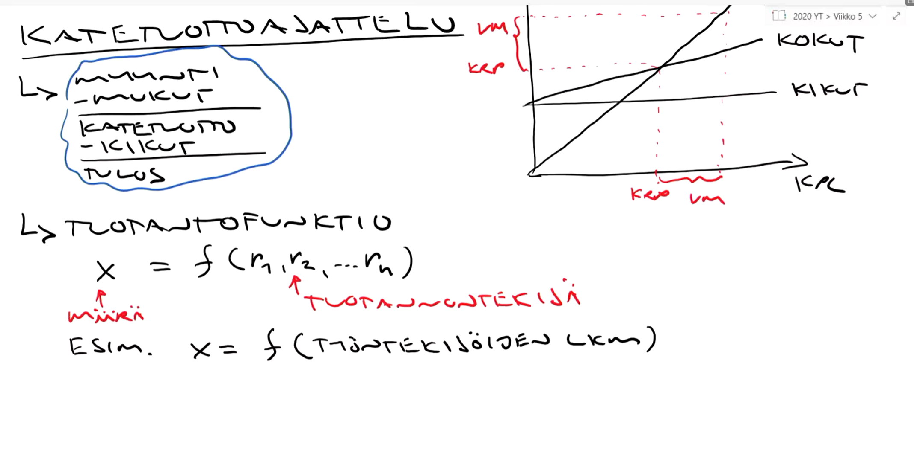

@1:17:42 tenttikysymys 9.

### Luento 10 Katetuottojattelu, kustannuslaskennan perusasetelma, kustannuslajilaskenta (aine- ja työkustannukset)

@6:20 tenttikysymys 10.

@7:24 Jatkoa katetuottoajatteluun

- Teoreettista ja pelkistettyä mallintamista
- Kannattavuuskuvio (se missä on se kriittinen piste) liian ideaali
  - Oikeasti useampia kriittisiä pisteitä
- Mallinnus voi kuitenkin toimia
  - Kapealla tarkasteluvälillä
  - Pieni toiminta-asteen vaihteluväli
  - Lyhyellä aikavälillä
- Ei sovellu strategiseen suunnitteluun (Liian pitkä aikaväli)
- Saattaa soveltua budjettisuunnitteluun, tulossunnittelussa ja hinnoittelussa (Mahdollisesti tarpeeksi lyhyt aikaväli)

@19:50 Toiminnan sopeuttaminen, valmis kuva alla

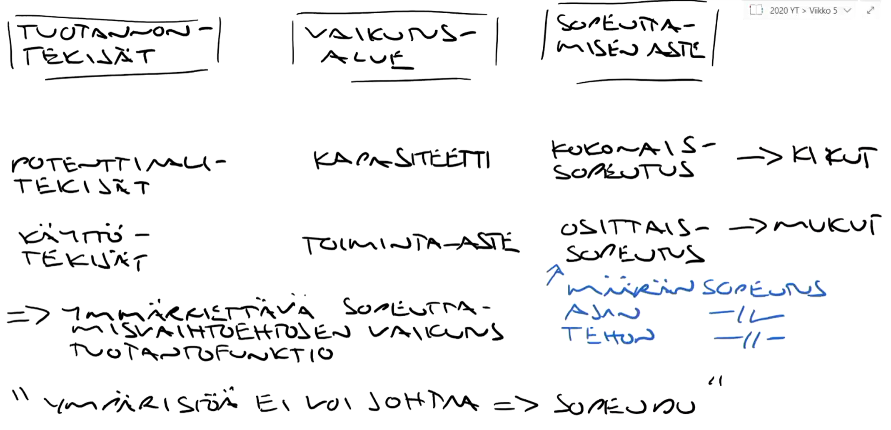

Esimerkki

Potentiaalitekijät = Työkone

Käyttötekijät = Työvoima

Kapasiteetti = Työkoneen maksimaalinen output per tunti

Toiminta-aste = Työkoneen todellinen output per tunti

Kokonaissopeutus = Lisätään tai vähennetään työkoneita, vaikuttaa kapasiteettiin ja kikuihin

Osittaissopeutus = vaikuttaa toiminta-asteeseen ja mukuihin

- Määrän sopeutus = Lisätään tai vähennetään työntekijöitä
- Ajan sopeutus = Lisätään tai vähennetään työtunteja
- Tehon sopeutus = Nopeutetaan tai hidastetaan työtahtia (Vrt. riski työtapaturmiin, burnoutteihin yms.)

Oma mp: Huomaa todellisuudessa paljon kompleksisempaa eikä lineaarista. Lisääminen tai vähentäminen ei suoraa aina lisää tai vähennä outputtia. Esimerkiksi organisaation kyky toimia tehokkaasti sen skaalautuessa suuremmaksi, [syvemmin selitettynä](https://codahale.com/work-is-work/).

@39:57 Kustannuslajilaskenta, valmis kuva alla

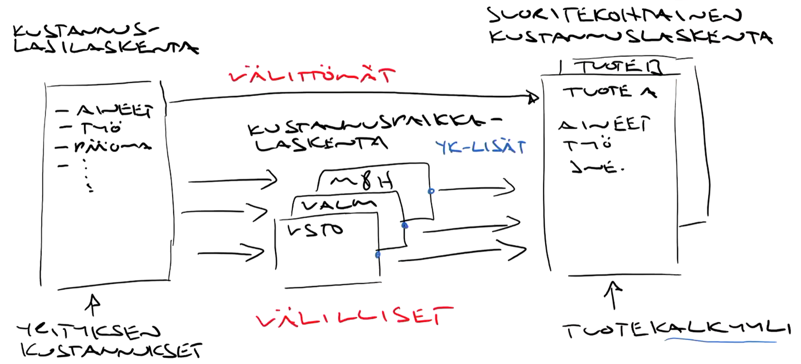

@56:35 Ainekustannukset

- Jälkilaskenta

  - Varastoinnista johtuva arvostusongelma
    - ➡️ Inventointimenettely

- Ennakkolaskenta

  - Määrät ja hinnat perustuvat standardeihin, jälkilaskelmiin tai perstuntumaan

@59:25 tenttikysymys 11.

@1:18:27 Työvoimakustannuksen rakenne

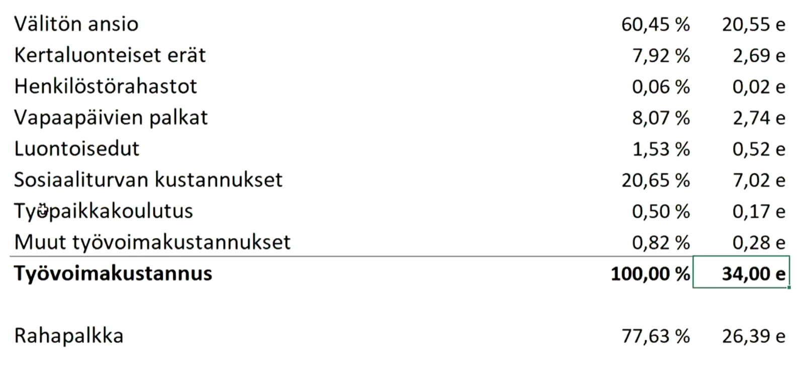

### Luento 11 Kustannuslajilaskenta, kustannuspaikkalaskenta, suoritekalkyylityypit, kalkyylit vs. liikekirjanpito

@5:30 Pääomakustannukset (jatkoa kustannuksista)

- Liittyvät tuotannontekijöiden hankkimiseen, hallussapitoon ja vakuuttamiseen
- KOM ➡️ Poistot ja korot
- ROM ➡️ Korot
- Poistot
  - Poistoaika
  - Poiston arvoperusta (Alkuperäinen-, jälleenhankintameno ja menojäännöspoisto)
  - Poiston jaksottaminen
    - Tasan ➡️ Tasapoisto
    - Etupainotteinen ➡️ Menojäännöspoisto
    - Takapainoitteinen ➡️ Annuiteetttipoisto
- Korot
  - Sitoutuneet pääoman korot (Mahdollistaa vaihtoehtoiskustannuksen)
  - Maksetut korot (Maksetaan vain vieraasta pääomasta)
  - Ei oteta mukaan laskelmiin

@15:05 tenttikysymys 2.

#### @25:02 Kustannuspaikkalaskenta

- Mihin tarvitaan?
  - Organisaation vastuualueen valvonta
  - Tuotteen kustannuksen selvittämiseen
- Miten toteutetaan?
  - Lasketaan kustannukset ja tuotteet
- Miten muodostetaan?
  - Jaetaan vastuut
  - Sovitaan yhtenäisestä mittayksiköstä (vertailtavuus)
  - Esim. projekti, tiimi, kone yms.
- Yleiskustannuslisät (YK-lisät) = Välilliset kustannukset / tuotteen kustannus

@44:25 tenttikysymykset 16. ja 18.

@49:05 Suoritekohtainen laskenta = Mitä kustannuksia otetaan mukaan ja mitä ei

- Minimikalkyyli
- Keskimäääräskalkyyli
  - Reagoi toiminta-asteen vaihteluun!
- Normaalikalkyyli
  - EI reagoi toiminta-asteen vaihteluun

@57:48 tiivistelmä kalkyyleistä, valmis kuva alla.

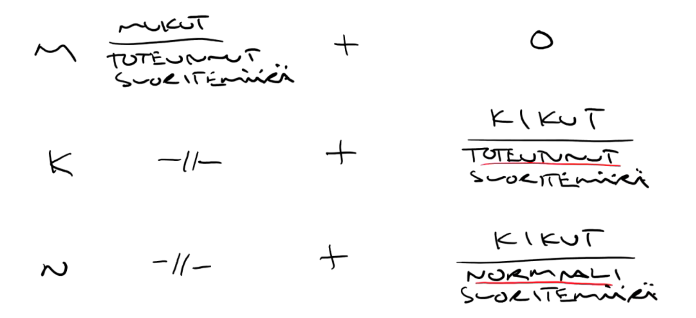

- Kalkyyleissa vain kiinteiden kustannusten laskeminen eroaa

### Luento 12 Tuotantotyypit ja laskentajärjestelmät, jakolaskenta sovelluksineen, budjetointi

@16:42 tenttikysymys 15.

#### @19:19 Jakolaskenta

> "Jakolaskenta (process costing) sopii käytettäväksi, kun yritys valmistaa yhtä tuotelajia (yhtenäistuotanto). Jakolaskennassa kustannukset jaetaan suoritteiden määrällä. Esim. sellutehtaan kokonaiskustannukset voidaan jakaa tuotettujen sellutonnien määrällä. Tällöin saadaan selville sellutonnin kustannus.
>
> Lisäyslaskentaa (job order costing) käytetään, kun yritys valmistaa monia erilaisia tuotteita (monituoteyritys). Tällöin suoritteille kohdistetaan suoraan välittömät kustannukset ja välilliset kustannukset erityisen lisän (yleiskustannuslisä) avulla. Yleiskustannuslisän suuruus riippuu siitä, miten suorite aiheuttaa välillisiä kustannuksia. Välilliset kustannukset saattavat esim. riippua konetuntien määrästä, jolloin suoritteelle kohdistetaan yleiskustannuslisänä välillisiä kustannuksia sen tuotantoon käytettyjen konetuntien perusteella."
>
> [Blogista](https://www.lily.fi/blogit/chasing-my-future/3-9-suoritekohtainen-kustannuslaskenta/)

- Lisäksi ekvivalenssilaskenta (summataan samankaltaiset tuotteet yhteen)

@44:26 Budjetti

- Toimintasuunnitelma (= sitoudutaan suunnitelmaan)
- Yleensä rahamääräisiä
- Tietty aikaväli
- Tavoitteena optimointi
- Sidottu yrityksen strategiaan
- Vastuuhenkilöiden taloudellinen sopimus
- Koordinoi tavoitteita
- Tuottaa informaatiota

Oma mp: En ymmärrä alkuunkaan suunnittelua, johon ei sitouduta (toimintasuunnitelman merkitystä yllä). Mitä järkeä luoda suunnitelmia, joita ei hyödynnetä/toteuta/sitouduta? Ei se ole suunnittelua, se on haaveilua. Brainstorming ja muut vastaavat ovat oma asiansa.

Budjetointi (= budjetin tekeminen)

- Vaihtoehtojen etsimistä

@1:04:12 tenttikysymys 23.

#### @1:05:17 Budjettijärjestelmä

- Pääbudjetit
  - Tulosbudjetti
    - Liittyy yrityksen kannattavuuteen
    - suoriteperusteinen
  - Rahoitusbudjetti
    - Liittyy yrityksen maksuvalmiuteen
    - maksuperusteinen
- Osabudjetit
  - Ostobudjetti
  - Myyntibudjetti
  - Valmistusbudjetti

#### 1:09:31 Budjetointimenetelmät

- Autoritäärinen (ylhäältä alaspäin)
- Demokraattinen (alhaalta ylöspäin)
- Edellisten yhdistelmä (iteroiva)

Oma mp: Jos ei armeijaa pyöritetä, niin mielestäni iteroiva tapa on ehdottomasti paras.

1:25:08 Budjettitarkkailu

- Tavoite - toteuma = ero
- Mikä meni pieleen arvioissa? ➡️ Korjaavat toimenpiteet
- Aikajänne
  - Vuositasolla ➡️ keskeiset tavoitteet
  - Neljännesvuosi- ja kuukausitarkkailu ➡️ tarkastetaan tulos- ja rahoitusbudjettien tilanne

### Luento 13 Standardikustannuslaskenta, investoinnit

@3:37 Rullaava budjetointi = Budjetti pidetään vuoden mittaisena, joka kuukausi

@5:10 Liukuva budjetointi = Budjetti joustaa toiminta-asteen mukana. Eli ei tiukkaa budjettia.

@6:17 Nollapohjabudjetoiniti = Lähdetään aina puhtaalta pöydältä

#### Standardikustannuslaskenta

@13:30 Standardikustannuslaskenta = Tavoitelaskelma, EI kohdista kustannuksia.

@18:15 Tarkastellaan hinta- ja määräeroja, jotta ymmärretään paremmin tuloksen merkitystä. Eli yksityiskohtaisempaa tarkastelua.

@22:28 Standardit ovat tavoitteeksi asetettuja rahamääräisiä ja määrä lukuja. Esim standardihinta 10€ ja määrä 10 ➡️ Yhteensä 100€, mutta tarkestellaan onko jompaa kumpaa rikottu.

@23:05 Tenttikysymykset 19. ja 20.

@32:55 Standardityypit

- Perusstandardit = Ei muutu pitkällä aikavälillä, vertailua varten. Aikaväli vuosi, kaksi vuotta.

- Ihannestandardit = Paras mahdollinen suoritus, ihannetavoite.

- Normaalistandardit = Hyvä suortus, realistinen tavoite.

@42:15 Standardikustannuslaskenta ei yleinen, koska raskas järjestelmä. Sopii lähinnä yritykseen, jonka olosuhteet ovat suhteellisen muuttumattomat.

Oma mp: Juuri tämän takia ei ole yleinen, koska harvalla yrityksellä on vakiot olosuhteet nykypäivänä.

@49:18 Standardikustannuslaskennan hyöty: Voidaan jakaa ero hintaan ja määrään, jolloin voidaan työnjako tehdä helposti eri henkilöille.

Oma mp: Siiloutumisen riski, tehdäänkö enää järkeviä päätöksiä? Vastakkainasettelu?

#### Investoinnit

@58:30 Investoinnin määritelmä = Suuri summa rahaa jonkin kohteeseen.

Oma mp: Pienikin sijoitus on sijoitus, eli investointi. Pienistä puroista ..

@1:00:00 Investointi on pois muualta. Vrt. Vaihtoehtoiskustannus.

@1:01:00 Investoinnnin ominaisuuksia

- Sitoo päätöksentekoa
- Aikaulottuvuus, ei mahdollista palata lähtötilanteeseen.
- Kertaluonteisuus

Huomioitavaa:

- Taloustieteen perusongelmat: Valinta ja niukkuus
- Suhdannevaihtelut
- Rahan aika-arvo, diskonttaus.

@1:19:30 Diskonttaus kaava = Tulo/((1+tuottovaatimus)^Vuodet)

Tulo = Rahasumma x vuoden päästä

Tuottovaatimus = 10%=0.1 jne.

@1:21:33 Tenttikysymykset 21. ja 22.

@1:22:15 Investoinnin vaikutusalueet

- Kannattavuus ➡️ Investointilaskelmat
- Maksuvalmius ja vakavaraisuus ➡️ Ajoitus (suhdannevaihtelut)
- Kasvu ➡️ Vaatii investointeja
- Tuottavuus ➡️ Investoidaan esim. työkaluihin, joilla parempaa tuottavuutta. Parempi tuottavuus ➡️ Kasvua
- Laatu ➡️ Paranee investoimalla
- Imago(Brändi?) ➡️ Investoidaan asioihin, jotka parantavat imagoa (Brändiä?)

### Luento 14 Investointilaskentamenetelmät ja investointilaskelmien lähtöarvot

@0:34 tenttikysymykset 21. ja 22.

#### @6:20 Nettonykyarvo

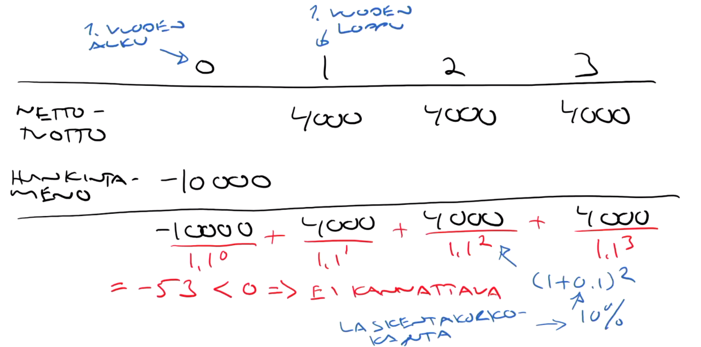

Diskontataan jokaisen vuoden nettotuotot nykyhetkeen ja vähennetään investointihinta

Mikäli jokaisen vuoden tuotto on tasaista, tiivistyy muotoon (Huomaa eri taulukosta kerroin).

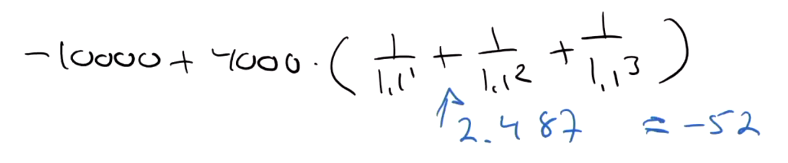

#### @21:04 Investointilaskelmien lähtöarvot

- Investoinnin suuruus (laajuusongelma suunnittelussa)
- Vuotuiset nettotuotot
  - Vuotuisten tuottojen ja kustannusten (EI sisällä poistoja tai korkoja!) erotus
  - Tuotto voi olla säästö
- Pitoaika
- Jäännösarvo (investoinnin pitoajan jälkeinen arvo, voi olla myös negatiivinen)
- Laskentakorkokanta (tuottotavoite)
  - Usein minimituottovaatimus
  - Yksi tapa ➡️ Keskimääräiset rahoituskustannukset
    - Esim. (VPO) 0.7\*5% + (OPO) 0.3\*15% = 8%
- Käyttöpääoman (VOM+myyntisaamiset-ostovelat) käsittely investointilaskelmissa
  - Maksuperusteinen- tai kustannusperusteinen tapa

Excel funktiot Nettonykyarvo NPV ja sisäinen korkokanta IRR

Takaisinmaksumenetelmä (= lasketaan milloin investointi on maksanut itsensä takaisin)

@1:20:15 Loppusanat
